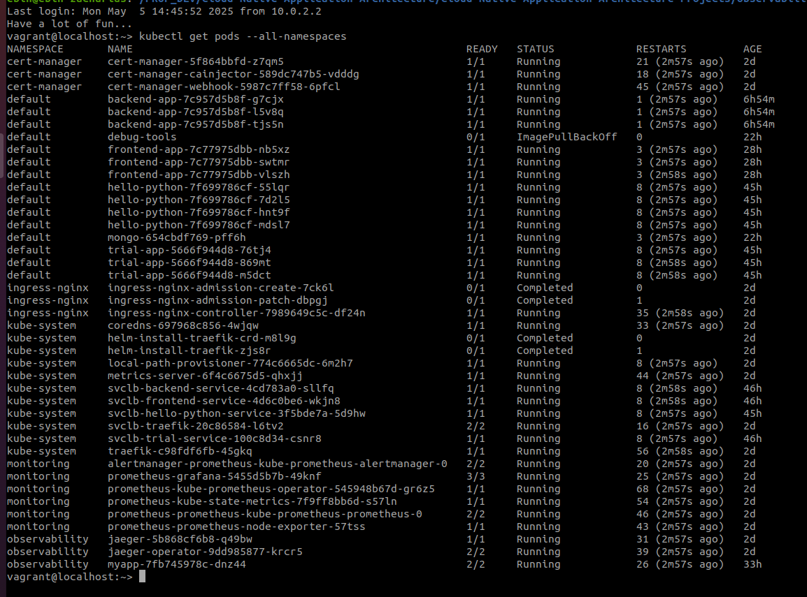
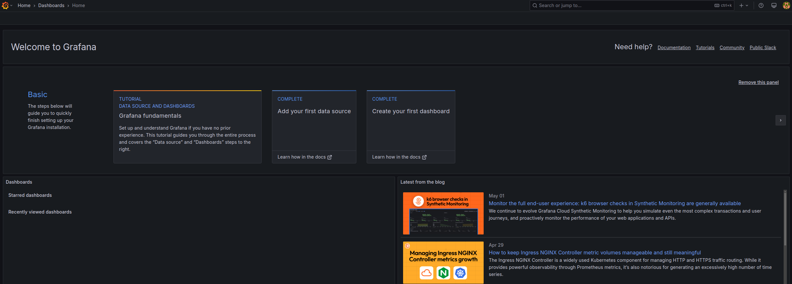
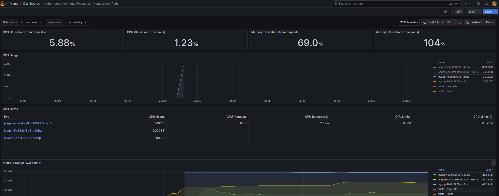
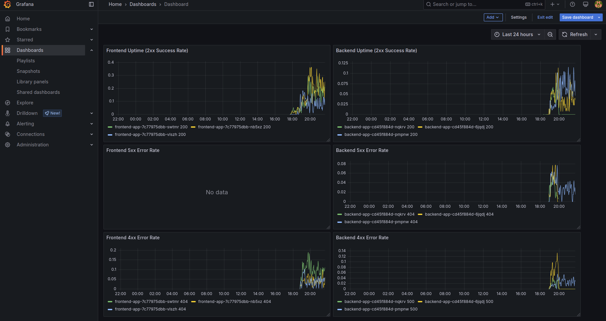
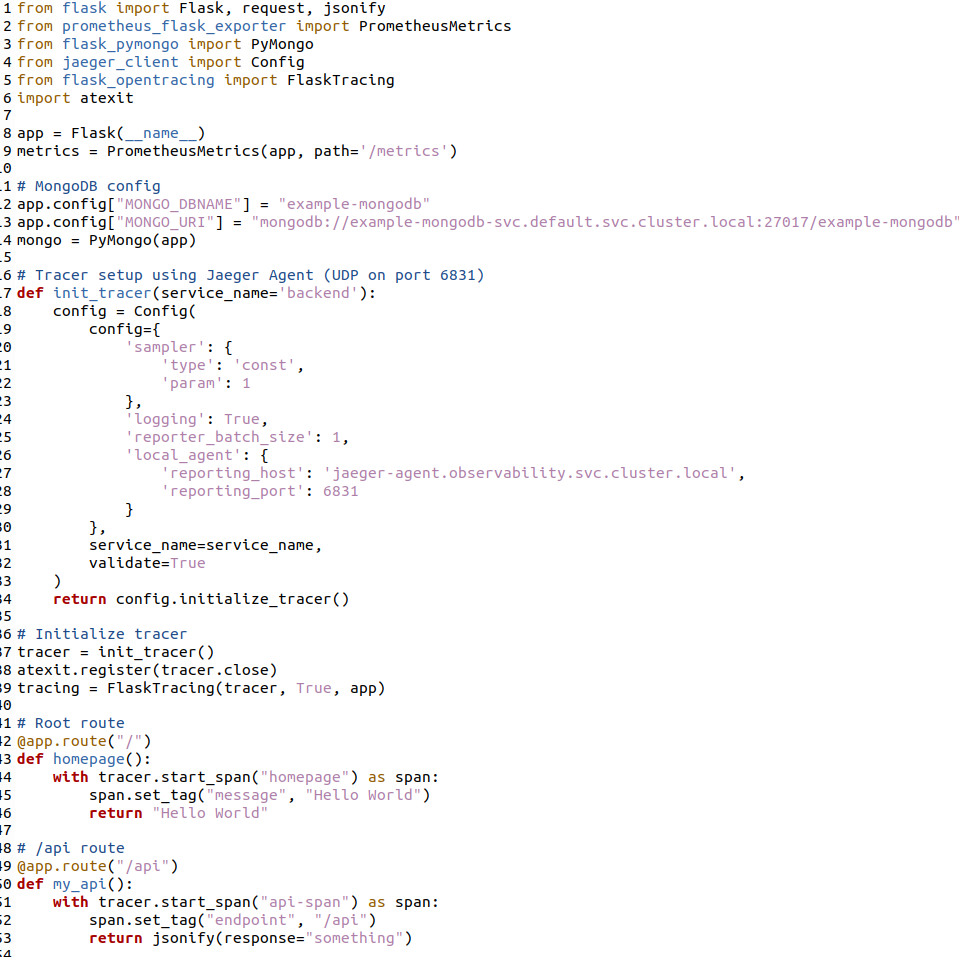
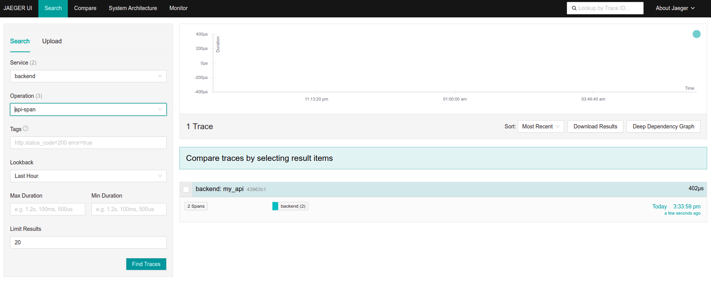
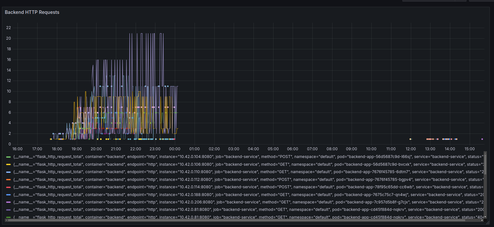
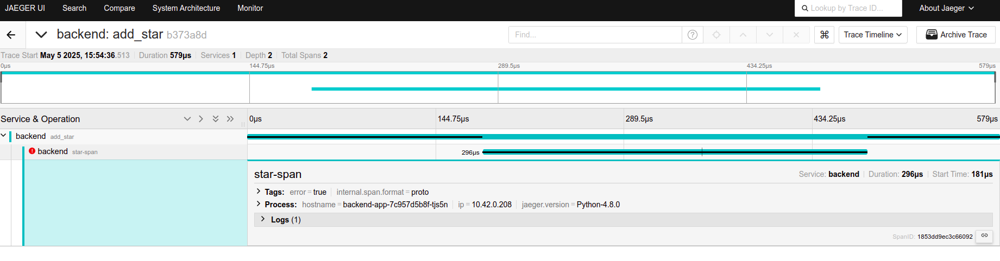
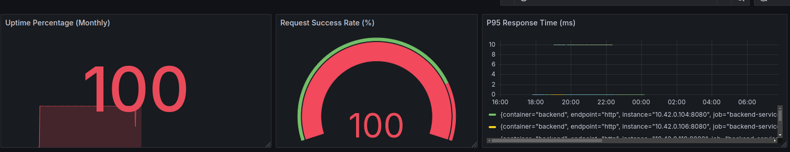

**Note:** For the screenshots, you can store all of your answer images in the `answer-img` directory.

## Verify the monitoring installation

*TODO:* run `kubectl` command to show the running pods and services for all components. Take a screenshot of the output and include it here to verify the installation

## Setup the Jaeger and Prometheus source
*TODO:* Expose Grafana to the internet and then setup Prometheus as a data source. Provide a screenshot of the home page after logging into Grafana.

## Create a Basic Dashboard
*TODO:* Create a dashboard in Grafana that shows Prometheus as a source. Take a screenshot and include it here.

## Describe SLO/SLI
*TODO:* Describe, in your own words, what the SLIs are, based on an SLO of *monthly uptime* and *request response time*.

**SLIs (Service Level Indicators)** are the actual measurements used to track if we meet our goals.  
- For a monthly uptime SLO, the SLI is the percentage of time the service was available in a month.  
- For a response time SLO, the SLI is the percentage of requests answered within the target response time.

## Creating SLI metrics.
*TODO:* It is important to know why we want to measure certain metrics for our customer. Describe in detail 5 metrics to measure these SLIs. 

**Important Metrics to Measure SLIs**

1. **Uptime Percentage**  - Availability  
   Measures the proportion of time the system is available and operational.It shows the reliability users experience.

2. **Request Success Rate**  
   Measures the percentage of requests that complete successfully — typically those returning HTTP 2xx or 3xx status codes. 

3. **Response Time** - Latency    
   Measures how fast the service responds to user requests. It ensures most requests are answered within the target time.

4. **Error Rate**  
   Calculates the percentage of requests that fail due to errors. A low error rate means the service is stable and reliable.

5. **Throughput**  
   Shows how many requests the service handles per second or minute, helping to monitor if the service can manage the load efficiently.

## Create a Dashboard to measure our SLIs
*TODO:* Create a dashboard to measure the uptime of the frontend and backend services We will also want to measure to measure 40x and 50x errors. Create a dashboard that show these values over a 24 hour period and take a screenshot.

## Tracing our Flask App
*TODO:*  We will create a Jaeger span to measure the processes on the backend. Once you fill in the span, provide a screenshot of it here. Also provide a (screenshot) sample Python file containing a trace and span code used to perform Jaeger traces on the backend service.

## Jaeger in Dashboards
*TODO:* Now that the trace is running, let's add the metric to our current Grafana dashboard. Once this is completed, provide a screenshot of it here.

## Report Error
*TODO:* Using the template below, write a trouble ticket for the developers, to explain the errors that you are seeing (400, 500, latency) and to let them know the file that is causing the issue also include a screenshot of the tracer span to demonstrate how we can user a tracer to locate errors easily.

TROUBLE TICKET

Name: Internal Server Error on /star endpoint

Date: 05.05.2025

Subject: 500 Error during POST to /star

Affected Area: app.py - Backend Flask API

Severity: High – request failure when storing new star data

Description: A 500 Internal Server Error is observed when sending malformed or empty JSON to the /star endpoint. Using Jaeger tracing, the star-span shows the failure along with the tag error=true. This confirms the issue originates from unhandled input parsing logic in the backend.

## Creating SLIs and SLOs
*TODO:* We want to create an SLO guaranteeing that our application has a 99.95% uptime per month. Name four SLIs that you would use to measure the success of this SLO.

**SLO:**

* Maintain **99.95% uptime** for the backend service per month.

**SLIs:**

1. **Availability** – Service is up and responding to requests.
2. **Success Rate** – Percentage of HTTP responses with status codes 2xx or 3xx.
3. **Error Rate** – Percentage of HTTP responses with status codes 5xx.
4. **Latency** – 95% of requests respond in under 500ms.

## Building KPIs for our plan
*TODO*: Now that we have our SLIs and SLOs, create a list of 2-3 KPIs to accurately measure these metrics as well as a description of why those KPIs were chosen. We will make a dashboard for this, but first write them down here.

**KPIs**

1. **Uptime Percentage (Monthly)**
   **Why:** Directly measures our 99.95% uptime SLO. Helps monitor if the service is consistently available throughout the month.

2. **Request Success Rate (%)**
   **Why:** Tracks the ratio of successful responses (2xx/3xx). A drop indicates user-facing issues and helps catch availability/reliability problems early.

3. **P95 Response Time**
   **Why:** Measures how fast 95% of the requests are handled. Chosen to ensure latency remains within acceptable limits for most users.

## Final Dashboard
*TODO*: Create a Dashboard containing graphs that capture all the metrics of your KPIs and adequately representing your SLIs and SLOs. Include a screenshot of the dashboard here, and write a text description of what graphs are represented in the dashboard.  

This Grafana dashboard visualizes the three key KPIs that track the application's SLIs and SLO:

1. **Uptime Percentage (Monthly)**  
   A stat panel that shows the average uptime of the backend service based on the `up` metric. A value of 100 indicates full availability during the measured period.

2. **Request Success Rate (%)**  
   A gauge panel that displays the percentage of HTTP requests returning 2xx or 3xx status codes. This directly reflects service reliability and user success rates.

3. **P95 Response Time (ms)**  
   A time-series graph showing the 95th percentile response time, which highlights the latency experience for the majority of users. It helps ensure performance stays within target limits.
